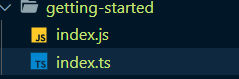

## 📖 타입스크립트 시작하기
### 타입스크립트 프로젝트 시작하는 방법(라이브러리 설치와 TSC)
- 브라우저가 아직 `ts`파일을 인식할 수 없음
- 따라서 `ts`확장자 파일을 브라우저가 인식할 수 있는 `js`파일로 변환을 해줘야하는데 이것을 **컴파일**이라고 한다.

#### comfile하는 방법
1. 컴파일할 폴더 오른쪽 클릭, 터미널에서 열기

2. ```npm i typescript -g```

	- 타입스크립트를 로컬시스템에 설치
3. ```tsc index.ts```
- index.ts파일을 js파일로 변환하겠다는 뜻
- 컴파일한 결과



### 타입스크립트 설정 파일
- 일일이 컴파일하는 번거로움보다는 웹팩 같은 모듈번들러 혹은  웹자동화 도구(웹태스크매니저)를 이용해서 반복적인 명령어들을 자동화 할 수 있도록 한다.
- 타입스크립트 사용시 웹팩을 알아두면 좋다.

#### tsc 부가적인 옵션을 주는 방법
- 컴파일 폴더안에서 `tsconfig.json`파일 생성
```js
// tsconfig.json
{
	"comfileOptions": {
		"allowJs" : true,
		"checkJs" : true,
		"noImplicitAny": true  
	}
}
```
- `allowJs`
	-  파일안에 js파일을 허용한다는 것
- `checkJs`
	- `@ts-check` 와 같다. js에서 TS의 기능을 활용하고, 타입 검사 기능을 js에 녹여내겠다는 용도로 사용한다.
- `noImplicitAny`
	- 모든타입에대해서 최소한 any 라고하는 기본적인 타입이라도 명시적으로 적어야한다.
	
### [타입스크립트 플레이그라운드 사이트 소개](https://www.typescriptlang.org/play?#code/PTAEHUFMBsGMHsC2lQBd5oBYoCoE8AHSAZVgCcBLA1UABWgEM8BzM+AVwDsATAGiwoBnUENANQAd0gAjQRVSQAUCEmYKsTKGYUAbpGF4OY0BoadYKdJMoL+gzAzIoz3UNEiPOofEVKVqAHSKymAAmkYI7NCuqGqcANag8ABmIjQUXrFOKBJMggBcISGgoAC0oACCoASMFmgY7p7ehCTkVOle4jUMdRLYTqCc8LEZzCZmoNJODPHFZZXVtZYYkAAeRJTInDQS8po+rf40gnjbDKv8LqD2jpbYoACqAEoAMsK7sUmxkGSCc+VVQQuaTwVb1UBrDYULY7PagbgUZLJH6QbYmJAECjuMigZEMVDsJzCFLNXxtajBBCcQQ0MwAUVWDEQNUgADVHBQGNJ3KAALygABEAAkYNAMOB4GRogLFFTBPB3AExcwABT0xnM9zsyhc9wASmCKhwDQ8ZC8iElzhB7Bo3zcZmY7AYzEg-Fg0HUiS58D0Ii8AoZTJZggFSRxAvADlQAHJhAA5SASAVBFQAeW+ZF2gldWkgx1QjgUrmkeFATgtOlGWH0KAQiBhwiudokkuiIgMHBx3RYbC43CCJSAA)
- 타입스크립트 class 변환
```js
class Student {
	name : string; // 타입지정

	constructor(name:string) {
		this.name = name
	}
}
```

### 🔍 참고 출처
- [npm 공식문서](https://joshua1988.github.io/webpack-guide/build/node-npm.html#node-js)
- [타입스크립트 설정 파일 옵션](https://www.typescriptlang.org/docs/handbook/compiler-options.html)
- [타입스크립트 입문 - 기초부터 실전까지](https://www.inflearn.com/course/%ED%83%80%EC%9E%85%EC%8A%A4%ED%81%AC%EB%A6%BD%ED%8A%B8-%EC%9E%85%EB%AC%B8/dashboard)
