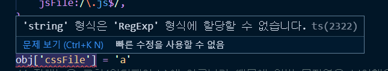
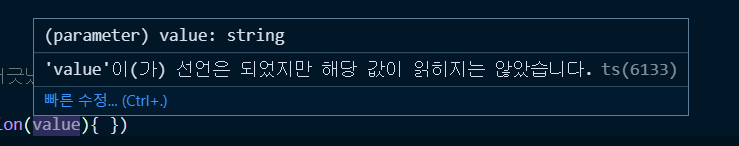

## 📖 인터페이스
### 인터페이스 소개 및 변수를 정의하는 인터페이스
```js
interface User {
	age:  number,
	name:  string
}

const joo  :  User
```
- **joo 라는 변수는 user라는 인터페이스로 정의 되어있다.**
- interface를 적용할때의 장점은 동일한 규정으로 약속되어 있기 때문에 오타가 나거나 다른사람이 코드를 보더라도 타입의 규칙을 한눈에 확인할 수 있다는 것이다.
- joo 라는 변수는 상호간의 약속했던 규칙을 따라서 interface의 속성에 맞게 무조건 정의되어야 한다.

### 함수의 인자를 정의하는 인터페이스
```js
// 함수에 인터페이스 활용
function  getUser(user:User) { 
// user라는 인터페이스의 형식만 따르는 데이터를 받겠다는 것
	console.log(user);
}

const capt = {
	name : '캡틴',
	age:100
}

getUser(capt)
```

- 인터페이스는 상호간의 약속이기 때문에 인터페이스를 사용한다고 하는 것은 이 함수는 항상 특정형식을 준수하는 데이터만 받겠다고 정의하는 것이다.
- 인터페이스에 형식을 따르지 않는다면 에러가 발생하고,
- 인터페이스에 맞게 속성을 정의해준다면 getUser에 인자를 넘길 수 있는 자격이 생긴다.
- 파라미터에 정의한 인터페이스에 규칙을 잘 따르는지 확인하는 것이 타입스크립의 역할이고 인터페이스의 장점이다.


### 함수 구조를 정의하는 인터페이스
```js
// 함수의 스펙(구조)에 인터페이스를 활용
interface SumFunction {
	(a:  number, b:number):number;
}

var sum:  SumFunction;
sum  =  function(a:number, b:number):number {
	return a + b
}
```
- api를 호출해와서 데이터 모양을 정의하고 활용할때 ts가 가장 빛을 발하는 구간이다.
- 라이브러리를 직접 만들거나 여러명이서 협업할때 함수의 규칙을 정할때 사용한다.

### 인덱싱 방식을 정의하는 인터페이스
```js
// 인덱싱
interface StringArray {
	[index:number] :  string // 배열에 있는 모든 값의 타입은 string
}

let arr:StringArray = ['a','b','c'];

arr[0] // 'a'
```
- 속성이름이 정해지지 않고 사용할때마다 속성을 임의로 부여해서 사용하는 방식
- 배열의 인덱싱 방식에 대해서 인터페이스를 정의할 수 있다는 것.

### 인터페이스 딕셔너리 패턴
```js
interface StringRegexDictionary {
	[key:string] :  RegExp
}

let obj:  StringRegexDictionary = {
	// cssFile:'css'
	cssFile:  /\.css$/,
	jsFile:/\.js$/,
}
```
```js
obj['cssFile'] =  'a' // 오류
```




- 객체의 인덱스에 정규식이 아닌 일반 문자열로 접근했을때 정해놓은 인터페이스 규칙이 어긋났기 때문에 오류가 발생한다.

  

```js
Object.keys(obj).forEach( function(value) { })
```



- 딕셔너리 패턴에 의해서 위처럼 obj를 조작할때마다 타입스크립트가 자동적으로 추론해서 타입까지 정의해준다.


### 인터페이스 확장(상속)
- 인터페이스 확장이란, OOP의 상속, 자바스크립트의 프로토타입처럼 인터페이스를 상속받아서 기존의 속성보다 더 확장해서 쓸 수 있는 것들을 말한다.


```js
interface Person {
	name:string;
	age:number;
}

interface Developer extends Person { // Person의 인터페이스를 Developer로 확장
	language:string;
}
```
- **중복되는 속성들을 다른 인터페이스가 갖고있다면 해당하는 속성과 타입에 대해서 확장을 받아서 사용할 수 있다.**
  
```js
var captain:  Developer = {
	language: 'ts',
	age:100,
	name:'캡틴'
}
```
- **Person에서 확장을 받았기 때문에 Person에 있는 타입들까지 모두 정의해줘야한다.** 이것이 인터페이스 확장의 규칙이다.
