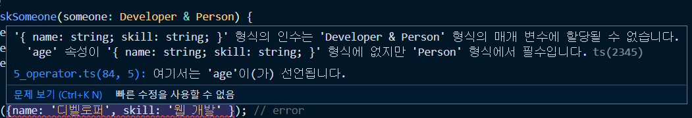

## 📖 연산자를 이용한 타입 정의
### 연산자를 이용한 타입 정의 - Union Type
```ts
function  logMessage(value:string  |  number) {
	console.log(value);
}

logMessage('hello');
logMessage(100);
```
타입을 하나 더 추가하고 싶을때 `|` 를 추가하고 타입을 입력한다. 
- `|` 는 타입스크립트에서 `유니온 타입(Union type)` 이라고 하고, 유니온 타입은 하나 이상의 타입을 정의하고 싶을때 사용한다.

### 유니온 타입의 장점
```ts
let seho:  string  |  number  |  boolean;
```
- 변수에 유니온 타입 정의
	- 선언하고 싶은 타입을 추가해주면 된다.

```ts
function  logMessage(value:string  |  number) {
	if(typeof value ===  'number' ) {
		value.toString()
	}

	if( typeof value ===  'string' ) {
		value.toLocaleLowerCase()
	}

	throw  new  TypeError('value must be string or number');
	// 유니온타입 속성을 이용해서 에러 string과 number가 아닌 경우에 TypeError를 출력할 수 있음.
}
```
- **any 타입과의 차이점은**
	- `any`의 경우 any로 되어 있기 때문에 타입스크립트가 추론하는 시점에서 타입을 정의할 수 없어서 변수에 대한 **api의 속성들을 확인할 수 없다.**
	- `유니온타입`에 경우 해당 타입에 맞게 api를 바로 확인하고 사용할 수 있다.
  
- 위처럼 타입을 구분하는 과정을 타입 가드라고 한다.
	- 타입가드란? 특정 타입으로 타입의 범위를 좁혀나가는 (필터링) 하는 과정이다.

### 유니온 타입의 특징
```ts
interface Developer {
	name:string;
	skill:string;
}

interface Person {
	name:string;
	age:number;
}
function  askSomeone(someone:  Developer  |  Person) { 
	someone.age // x
	someone.skill // x
	someone.name // o
}
```
- **유니온타입은 인터페이스 두개를 연결했을때 공통적인 속성만 접근할 수 있다.**
	- 에러의 위험이 있기때문에 공통된, 보장된 속성만 제공

- 공통된 속성에 접근하고 싶다면 **타입가드**를 이용해 특정 타입으로 제한한 뒤 접근해서 걸러내는 방식으로 하는것을 추천한다.

}

### 인터섹션 타입 소개
```ts
let capt:  string  &  number  &  boolean; // x never
```
string, number, boolean을 모두 만족하는 타입
```ts
function  askSomeone(someone:  Developer  &  Person) {
	someone.skill
	someone.age
	someone.name
}
```
- 인터섹션이란 someone 타입이 Developer와 Person의 속성을 연결해서 모두 만족하도록 정의하는 것 `function  askSomeone(someone:  Developer  &  Person)`
- **Developer와 Person의 속성을 모두 포함하는 타입으로 정의했기 때문에 두 속성 모두에게 접근이 가능하다.**
	- **이것이 유니온과 인터섹션의 차이점**

### 유니온 타입과 인터섹션 타입의 차이점
- **유니온 타입 호출시**
```ts
function  askSomeone(someone:  Developer  |  Person) { }

askSomeone({name: '디벨로퍼', skill: '웹 개발' }); // Developer
askSomeone({name: '펄슨', age: 100 }); // Person
```
Developer나 Person의 규격에 맞게 호출시 데이터를 넘겨주면 된다.

> 상대적으로 인터섹션 타입보다 유니온 타입이 많이 쓰인다.

- **인터섹션 호출시**
```js
function  askSomeone(someone:  Developer  &  Person) {
	someone.skill
	someone.age
	someone.name
}

askSomeone({name: '디벨로퍼', skill: '웹 개발' }); // error
askSomeone({name: '펄슨', age: 100 }); // error

askSomeone({name: '디벨로퍼', skill: '웹 개발', age: 100 }); // success
```
유니온타입처럼 데이터를 넘겨줄 경우 error가 발생 



프리뷰를 보면 Developer 와 Person의 속성이 합한 객체를 넘겨달라는 메세지가 나온다.

#### 유니온 타입 vs 인터섹션 타입
- `유니온 타입`의 경우 **함수 내부에서 타입가드, 타입 추론을 실행**해야하는 작업이 있는 반면에, **실제로 넘기는 타입에 대해서는 선택지가 생긴다.**
  
- `인터섹션`의 경우에는 **두개 타입을 모두 포함**하는 새로운 타입을 만들게 되는다는  차이점이 있다.


### 🔍 참고 출처
- [타입스크립트 입문 - 기초부터 실전까지](https://www.inflearn.com/course/%ED%83%80%EC%9E%85%EC%8A%A4%ED%81%AC%EB%A6%BD%ED%8A%B8-%EC%9E%85%EB%AC%B8/dashboard)
- [타입스크립트 핸드북](https://joshua1988.github.io/ts/)

