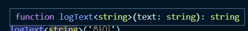

## 📖 제네릭
### 제네릭 소개
- 타입이 들어간 언어에서 가장 많이 활용되는 문법
- C#, JAVA 등의 언어에서 재사용성이 높은 컴포넌트를 만들때 자주 활용되는 특징
- 특히 한가지 타입보다 여러가지 타입에서 동작하는 컴포넌트를 생성할때 사용
- 타입을 함수의 파라미터의 개념으로 받게되는 것

### 제네릭의 기본 문법
- 일반 함수 사용시 예
```js
function logText(text) {
	console.log(text);
	return text
}
logText(10); // 숫자 10
logText('하이'); // 문자열 하이
logText(true); // 진위값 true
```
- 제네릭

함수에서의 제네릭 선언
```ts
function  logText<T>(text:T):T {
	console.log(text);
	return text
}
```

함수 호출시
```ts
logText('하이')
```


- '하이'라는 문자열을 넘겨주니 함수의 파라미터 타입은 '하이'라는 문자열이 되고, 반환값도 '하이'라는 문자열로 정의되었다.
- 즉 타입을 정의하는 방법은 **함수를 호출할때 파라미터의 값의 타입이 무엇인지 정의해서 넘겨주는 것**이다.

위의 함수 예제는 제네릭 문법을 사용한 것은 아니고 타입스크립트에서 자연적으로 추론해준 것이다. 

- **제네릭으로 정의하는 방법**
```ts
logText<string>('하이');
```



- logText 함수에 string이라는 타입을 넘기겠다는 뜻
- 즉 안에서 처리하는 text의 타입은 모두 문자열이여야 한다. 라고 명시적으로 정의해준 것.

> 제네릭은 호출하는 시점에 문자열이나 숫자같은 타입을 정의한다.


### 기존 타입 정의 방식과 제네릭의 차이점 - 함수 중복 선언의 단점
- 기본 문법에서 타입을 구분하지 않고 전부 받을 수 있는 이유는?
	- 함수에서 타입을 정의하지 않았기 때문에 암묵적으로 함수의 타입은 'any'라고 지정되어 있다. 때문에 어떤 타입이든 다 받을 수 있다.

파라미터를 문자열로 정의하고 문자열을 활용하는 함수를 짜는 로직을 만들었을때 logText는 문자열만 받을 수 있게된다.
```ts
function  logText(text:string) {
	console.log(text);
	text.split('').reverse().join(''); // string이기 때문에 가능한 로직
	return text
}
logText('하이'); // 문자열
logText(10); // 숫자
logText(true); // 진위값
```
그렇기에 숫자나 다른 타입을 받고싶지만 못받게되는 상황이 생긴다.

이럴 때에 해결 방법으로 숫자와, 불리언도 받을 수 있도록 함수를 여러개를 정의할 수 있다.
```ts
function  logNumber(num:number) {
	console.log(num);
	return num
}
logNumber(10);
```

하지만 이렇게되면 유지보수 관점에서 봤을때 불필요한 코드가 계속 반복되기 때문에 좋지 못한 코드가 된다.

### 기존 문법과 제네릭의 차이점 - 유니온 타입을 이용한 선언 방식의 문제점
- 함수 안에서 여러가지 타입을 받을 수 있는 유니온 타입 방식
	-  반환 값도 자동적으로 스트링값과 넘버값 반환해주는 특징이 있다.
```ts
function  logText(text:  string  |  number) { 
	console.log(text);
	return text;
}

logText('hi'); 
logText(10);
```
유니온 방식으로 선언했을 경우 파라미터 값을 호출해줄때 입력해주는 input에 대한 오류 문제점은 해결된다. 하지만


> **함수 내부 파라미터 변수에 접근을 해봤을때 string이나 number가 공통으로 접근할 수 있는 속성을 가진 api만 프리뷰에서 자동완성을 제공해준다는 문제점이 있다.**

또 다른 문제점은
```ts
const a = logText('a'); 
a.split('');
```
반환되는 값이 string과 number로 반환되고


**문자를 입력했음에도 불구하고, 문자열 관련 api `split`를 사용했을때 타입 에러가 발생한다.**

정확하게 타입을 추론할 수 있어야만 split 함수가 제공되고 그렇기때문에 number가 들어올 경우에 문자열 관련 함수가 제공되지 않는다.

> 결국 이러한 에러들을 봤을때 input에 대한 문제점은 해결되었지만 반환값에 대한 문제점은 해결되지 않았다라는 것을 알 수 있다.

### 제네릭의 장점과 타입 추론에서의 이점
- 제네릭 정의 
```ts
function  logText<T>(text:T) : T { 
	console.log(text);
	return text
}
```
1. `logText<T>` 함수에 제네릭 정의
2. `logText<T>(text:T)` 정의한 타입을 파라미터 타입으로 정의하고
3. 리턴할때도 같은 타입을 사용한다라고 정의
  
- 제네릭 호출
```ts
const str = logText<string>('abc');
```
- 제네릭의 특징은 **함수를 호출할때 함수의 타입을 정의해주는 것**
- 함수를 string으로 정의했을때 input과 output, 즉 인자와 반환값이 모두 string이 될 것이다라는 것을 타입스크립트 내부에서 제네릭을 이용해 선언

```ts
str.split('');
```


str 변수가 string 타입인 것을 타입스크립트가 추론할 수 있기때문에 문자열 api를 활용할 수 있다.

이렇게 타입을 명확히 알고 구성해나가는 것이 제네릭의 장점이다.


### 제네릭 실전 예제 살펴보기 - 코드에 타입 정의하기
```ts
interface Email {
	value :  string;
	selected :  boolean;
}

const emails:  Email[] = [
	{ 객체1 },
	{ 객체2 },
	{ 객체3 }
];

interface ProductNumber {
	value :  number;
	selected :  boolean;
}

const numberOfProducts:  ProductNumber[] = [
	{ 객체1 },
	{ 객체2 },
	{ 객체3 }
];

function  createDropdownItem(item  :  Email  |  ProductNumber  ) { 
// 유니온타입으로 정의
		// ... 생략
}

```
- `emails`와 `numberOfProducts`의  value 값은 각 string, number로 타입이 다르다.  변수의 타입을 모두 수용할 수 있도록 정의해주어야 한다.
- 인터페이스로 `Email`과 `ProductNumber` 로 타입을 정의하고 유니온 방식으로 선언해주도록 한다.
- **하지만 동일한 속성들인데 속성안에서 타입이 하나 바뀌었다고해서 타입 정의의 대한 코드가 불필요하게 많이 늘어난다는 문제점이 있다.**
- 향후 어떤 타입이 오든지 수용할 수 있도록 매번 인터페이스를 통해서 타입을 정의하는 것이 아니라 어떤 타입이 오던 유연하게 대처할 수 있도록 해야한다. -> 제네릭 필요

### 인터페이스에 제네릭을 선언하는 방법
```ts
interface Dropdown <T> {
	value :  T;
	selected :  boolean;
}
```
인터페이스에 제네릭을 선언해주고
```ts
const obj  :  Dropdown<string> = { value:'abe' , selected: false }
```
특정 속성을 선언해주는 시점에 타입을 정의해주도록 한다.

`Dropdown<string>` 으로 정의해줬다면 value 의 값이 string으로 정의 된다는 뜻이고, 만약 `Dropdown<number>` 로 정의해줬다면 value의 값을 number로 정의된다는 뜻이다.

이렇게 인터페이스에 제네릭을 사용한다면 얼마든지 속성의 타입을 바꾸면서 활용할 수 있다.

### 제네릭 실전 예제 살펴보기 - 제네릭을 이용한 타입 정의
```ts
interface DropdownItem<T> { // DropdownItem은 타입을 받을 수 있다.
	value :  T;
	selected :boolean;
}
```
value마다 인터페이스를 선언해주는 것이 아니라 **하나의 인터페이스로 제네릭을 이용해서 여러가지 타입을 커버할 수 있는 제네릭의 장점**을 이용해서 타입을 정의하도록 한다.
  
```ts
// value 가 string
const emails:  DropdownItem <string> [] = [
	{ value: 'naver.com', selected: true },
	{ value: 'gmail.com', selected: false },
	{ value: 'hanmail.net', selected: false },
];

// value 가 number
const numberOfProducts:  DropdownItem <number>[] = [
	{ value: 1, selected: true },
	{ value: 2, selected: false },
	{ value: 3, selected: false },
];
function  createDropdownItem(item  :  Dropdown<string> |  Dropdown<number> ) { }
```

  
- 일반적인 인터페이스를 사용하는 방법보다 제네릭을 사용하니 코드가 깔끔해졌다.
- 이제 이처럼 `createDropdownItem(item  :  Dropdown<string> |  Dropdown<number> )` 유니온 타입을 사용하지 않고 createDropdownItem 을 호출할때 제네릭을 선언해주면서 코드를 줄여나갈 수 있도록 하자.

###  제네릭의 타입 제한
- 제네릭을 선언하고 문자열의 길이 `console.log(text.length)`를 출력하는 코드를 구현했을때  `'T' 형식에 'length' 속성이 없습니다.` 라는 메세지가 뜬다. 
	- 타입스크립트 입장에서는 함수에 어떤 타입이 들어오는지 알 수가 없다.
	-  `length` 가 있다는 것은 개발자만 알고있지, 타입스크립트는 추측할 수 없다.

- 제네릭의 타입 힌트를 추가적으로 주도록 한다.
	- length를 사용하기 위해서는 `<T>`라는 제네릭의 타입을 좀 더 제한, 구체적으로 힌트를 줘서 legnth가 있을 것이라고 내부에서 추측할 수 있도록 해야한다.


```ts
function  logTextLength <T> (text:T[]):T[] {
	console.log(text.length);
	text.length  // 가 제공됨 배열이기 때문에, forEach 제공
	text.forEach(text=>{
		console.log(text);
})
return text

}
logTextLength<string>(['hi','abc'])
```
- `logTextLength<T>(text:T[]):T[]`에 배열을 넘겨줌으로 T에는 length가 제공이 될 것이라는 추측을 도와준ㄴ다.
 - 함수 안에서는 제네릭의 타입이 배열인 것을 알고있기 떄문에 배열의 대한 타입으로 가정을 하고 그에 따른 속성이나 api를 제공한다.
### 정의된 타입으로 타입을 제한하기
타입을 배열로 지정하지 않고 특정타입으로 지정한뒤 넘겨받아서 사용할 수 있다.
```ts
interface LengthType {
	length :  number;
}
function  logTextLength<T  extends  LengthType>(text:T):T {
	text.length;
	return text
}
```
-  `<T extends LengthType>` 제네릭으로 받은 타입은 항상 LengthType의 하위 타입이다.
- `LengthType`에서 제공하는 속성이 있는 상태에서 추가로 정의해준다는 제한을 두는 것이다.

```ts
logTextLength('a')
```
문자열을 파라미터값으로 보내줄때 기본적으로 length 속성을 제공되기때문에 에러가 발생하지 않는다.

```ts
logTextLength(10)
```
- 숫자 타입은 length 속성이 제공되고 있지 않기 때문에 내부에서 에러 발생
- 내부 속성으로 제공되고 있지 않기 때문에 숫자는 포함할 수 없다.

```ts
logTextLength({ length : 10 })
```
- 객체도 정의해줄 수 있다.
- `length`가 아니라 `leng` 이라고 잘못 입력했을 경우에 받아들이지 못하고 에러 발생

### keyof로 제네릭의 타입 제한하기
```ts
interface ShoppingItem {
	name:  string;
	price :  number;
	stock :  number;
}

function  getShoppingItemOption<T  extends  keyof  ShoppingItem>(itemOption:T):T {
	return itemOption
}
```
- `<T  extends  keyof  ShoppingItem>` 
	- `ShoppingItem`에 있는 `key` 값 중에 한가지가 제네릭 타입
	- **`ShoppingItem`에서 정의되어 있는 속성 중 하나만 받을 수 있도록 제한하겠다**라는 뜻
	- 인자로는 name, price, stock중에서 한가지만 들어올 수 있도록 정의하는 것이다.
- `extends`는 기존의 정의된 인터페이스 혹은 타입들을 확장할때 사용
- 제네릭에 올 수 있는 인자를 제한하는 것처럼 keyof로 제네릭의 타입의 범위를 줄이는 것

```ts
getShoppingItemOption(10);
getShoppingItemOption<string>('a');
```


일반 문자열이나 숫자를 인자값으로 보내주니 에러 발생
  
```ts
getShoppingItemOption('name')
```
함수를 호출하고 인자로 보내 줄 키 값을 선택한다.

> `ctrl + space`를 누르게 되면 넘길 수 있는 인자값들이 자동완성 된다.


### 🔍 참고 출처
- [제네릭](https://joshua1988.github.io/ts/guide/generics.html#%EC%A0%9C%EB%84%A4%EB%A6%AD-generics-%EC%9D%98-%EC%82%AC%EC%A0%84%EC%A0%81-%EC%A0%95%EC%9D%98)
