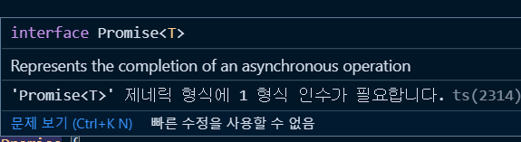
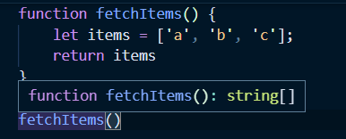
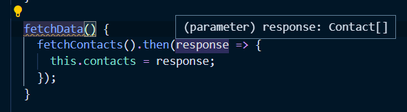

## 두 번째 프로젝트 - 전화번호부 애플리케이션
### 프로젝트 실습 방법 안내
- `tsconfig.json`
```js
"noImplicitAny": true,
"strict": true,
"strictFunctionTypes": true
```
- `eslintrc.js` 파일에서 에러를 명시적으로 표시해주기 위해 주석처리
```js
// '@typescript-eslint/no-explicit-any': 'off',
// "@typescript-eslint/explicit-function-return-type": 'off',
```
- ESLint 적용 안될때 
> `eslintrc.js`에서 에러가 표시되도록 설정해줬지만 eslint가 적용되지 않았음(빨간줄x, 함수에서 표시되야할 노란색 줄)
> 1. `package.json` 에서 ESLint 버전을 낮춤 `^5.16.0`으로 낮춰줬음
> 2. **해당 폴더** 에서 `npm i` 재 설치
> 3. **end of line**에서 CRLF를 LF로 바꿔줌

### 애플리케이션에 정의된 타입 설명 및 API 함수 타입 정의 힌트
API 목킹
```ts
// api
// 전화번호부를 불러오는 함수
function  fetchContacts():Promise {
	// ... 생략
	return  new  Promise(resolve  => {
		setTimeout(()  =>  resolve(contacts),  2000);
	});
}
```
- `fetchContacts` 함수는 Promise 방식을 return해줬기 때문에 반환 타입을 `Promise`로 정의해줘야 한다.



- Promise 타입으로 정의해주니 제네릭 형식을 요구하는 에러 메세지가 발생한다.

> 실제 개발 환경에서 제네릭이 가장 많이 사용되는 요소가 바로 api를 호출해와서 api 응답의 규칙, 규격의 정의할때 가장 많이 쓰인다.


### Promise를 이용한 API 함수 타입 정의
- 동기 함수
```ts
function fetchItems() { 
	let items = ['a', 'b', 'c'];
	return items; // 반환타입 string[]
}
const result = fetchItems();
console.log(result);  // result 의 결과는 기본적으로 string
```



`fetchItems` 함수를 생성하고 호출했을때 반환타입을 지정하지 않아도 반환되는 값(`items`)을 확인하고 기본적으로  string이 있는 배열이 반환 될 것이라는 것을 타입스크립트 내부에서 추론한다.

> 이처럼 동기적인 코드 (바로 실행이 가능해서 확인할 수 있는 코드)에 대해서는 타입스크립트가 추론이 가능하다.

**하지만 만약 비동기적인 코드라면?**

- 비동기 함수
```ts
function  fetchItems(){
	let items = ['a',  'b',  'c'];
	
	return  new  Promise(function  (resolve) {
		resolve(items);
});
}
```
위와는 다르게 비동기 `Promise` 방식으로 리턴을 했더니
 


타입스크립트 내부에서 리턴값을 추측하지 못하고 타입을 모르겠다는 `Promise <unknown>` 이라는 메세지가 생성된다. 

**즉, 현재 `fetchItems`를 실행하는 시점에서 타입스크립트가 `Promise`  안에 들어오는 비동기 코드들에 대해서 추론할 수 없다는 뜻**

> `Promise`를 제대로 쓰기 위해선 비동기의 반환값이 무엇인지 명시를 해줘야 한다.
또한 타입스크립트에서 `Promise`는 기본적으로 제네릭을 이용해서 정의된다.
- `Promise` 타입 정의

```ts
function  fetchItems():  Promise<string[]> {
	let items:  string[] = ['a',  'b',  'c'];
	
	return  new  Promise(function  (resolve) {
		resolve(items);
});
}
fetchItems();
```
**`Promise<string[]>`와 같이 타입을 `Promise`라고 정의하고 `Promise`의 타입까지 `<string[]>` 정의해주도록 한다.**

**`fetchItems():  Promise<string[]>`  타입 정의한 부분을 해석해보면
`Promise`의 `resolve`된 값이 `Promise`의 value가 될 것이다. 라고 해석할 수 있다.**

> 비동기 처리 방식이기 때문에 제네릭을 사용하는 것도 있지만, **`Promise` 자체에서 제네릭을 받게끔 타입스크립트 내부적으로 구현되어 있다.**


### 전화번호부 클래스 선언부 타입 정의
```ts
// main
class  AddressBook {
contacts:  Contact[] = []; // 메인변수 타입 정의

// 클래스가 생성될때 기본적으로 코드를 초기화 시키는 부분
constructor() {	
	this.fetchData(); // 메서드 호출
}

fetchData():  void {
	fetchContacts().then(response  => {
		this.contacts  = response;
	});
}
```




- `fetchData()`에서 `response`가 `Contacts[]` 인 이유는? 
	- **`fetchContacts`함수가 `Promise`를 반환하고 `Promise`의 value의 타입이 `Contact[]`가 될것이라고 명시해줬기 때문이다.**
	- 그렇기에 `then`으로 받아줬을때 기본적으로 제네릭으로 넘겨준 `Contact[]` 타입이 올 것이라는 것을 알 수 있음

### 전화번호부 검색 메서드의 타입 정의
```ts
findContactByName(name:  string):  Contact[] {
	// filter를 하기 떄문에
	return  this.contacts.filter(contact  => contact.name  === name);
}

findContactByAddress(address:  string):  Contact[] {
	return  this.contacts.filter(contact  => contact.address  === address);
}
```
리턴되는 반환 값을 잘 확인하고 타입을 정의해주자. 위의 함수들은 `filter`함수를 사용한 것으로 보아 배열값이 리턴된다고 추측할 수 있다.

### 📖 이넘을 이용한 타입 정의
`phoneType`의 경우에는 들어갈 수 있는 값들의 종류가 home, office, studio 총 세가지가 있다.
```ts
findContactByPhone(phoneNumber:  number, phoneType:  string): { }  
```
여기서 한가지,
실제로 코드를 짜다보면 오타를 보내주는 경우가 생길 수 있고 이러한 상황때문에 에러가 나는 경우가 빈번하게 발생한다.
```ts 
findContactByPhone('hone');
findContactByPhone('officce');
```
**즉 안전하게 보내주기 위해서 변수화를 해서 보내주도록 해야한다. 이것이 타입 관접에서 안전한 코딩이라고 볼 수 있다.**

우리는 `phoneType`이 home, office, studio 의 총 세개의 값에 대해서만 취급하는 것을 알기때문에 **`이넘`을 활용할 수 있다.**

```ts
enum PhoneType {
	Home  =  'home',
	Office  =  'office',
	Studio  =  'studio',
}

findContactByPhone(phoneNumber:  number, phoneType:  PhoneType):  Contact[] {
	return  this.contacts.filter(
		contact  => contact.phones[phoneType].num  === phoneNumber
	);
}  
```
`이넘`으로 정의하고 `phoneType` 으로 선언해주게 되면 
앞으로`findContactByPhone(phoneType.home)` 같은 형식으로 호출해서 에러를 최대한 방지할 수 있게 될 것이다.

### 🔍 참고 출처
- [타입스크립트 입문 - 기초부터 실전까지](https://www.inflearn.com/course/%ED%83%80%EC%9E%85%EC%8A%A4%ED%81%AC%EB%A6%BD%ED%8A%B8-%EC%9E%85%EB%AC%B8/dashboard)
- [제네릭(Generics)](https://joshua1988.github.io/ts/guide/generics.html)
