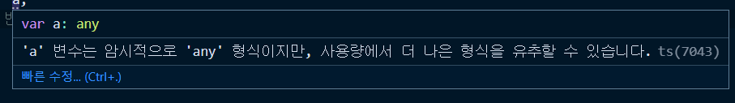
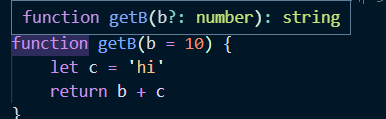
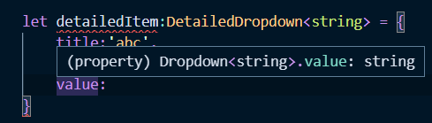
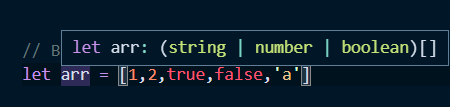

## 📖 타입 추론 (Type Inference)
### 타입추론 소개
타입추론(Type Inference) 이란 타입스크립트가 코드를 해석해나가는 동작을 의미한다.

#### 타입추론의 기본 1 
```js
let x = 3
```
- 특정 변수를 선언해서 값을 할당
- 함수 파라미터의 기본값, 반환값 지정

했을때 기본적으로 타입추론이 일어난다.

변수를 선언하면 ts 파일이기 때문에 vscode 내부적으로 Language 서버가 타입을 추론하기 시작한다.

> 이렇게 특정 변수의 관련된 타입, 정보들을 (타입스크립트 내부에서) 해석해서 보여주는 것을  `인텔리센스`라고 하고, 인텔리센스는 vscode에 내장되어있는 Language 서버의 기능이다.

```ts
var a;
```



`a`변수는 타입을 지정해주지 않았기 때문에 기본적으로 `any`라는 타입으로 정의되어 있다.

```ts
var a = 10;
```
`a`를 10으로 지정하면 `a`변수의 타입은 `number`로 변경된다. (`string`으로 선언할 경우 `string`)

 vscode에서 코드를 작성해나갔을때 코드 타입을 정의해나가는게 타입추론 방식이다. 기본적인 변수의 선언과 할당에 의해서 가볍게 타입 추론을 할 수 있다.

  
```ts
function  getB(b  =  10) {
	return b
}
```
파라미터를 `b = 10`를 선언해줬더니 반환값 또한 `number`로 추론해준다.


- **`number` + `string`을 리턴해준다면 반환되는 타입은?** 
```ts
function  getB(b  =  10) {
	let c = 'hi'
	return b + c
}
```
마치 자바스크립트 내에서 숫자 `10`과 문자열 `'10'`을 더해주면 `1010`의 결과가 나오는 것처럼 



`b = 10`과 `c = 'hi'`를 더해줬을때 리턴값이 `string`을 반환할 것이라고 타입스크립트 내부적으로 추론하고 있다.


> 이런 동작 하나하나가 타입 추론의 과정이다.

### 인터페이스와 제네릭을 이용한 타입 추론 방식
#### 타입추론 기본 2
- `interface` + `제네릭` 방식
	- `Dropdown` 인터페이스에 타입을 줄때 추가적인 타입을 받아서 value에 그 타입을 가져다 쓰는 형태

```ts
interface Dropdown<T> {
	value:T;
	title:string;
}

let shoppingItem:Dropdown<string> = {
	value:'abc',
	title:'hello'
}
```
인터페이스 제네릭을 정의했을때 제네릭의 값을 타입스크립트에서 추론해서 변수의 필요한 속성들과 타입까지 보장해주는 타입추론의 기본적인 방식이다.

### 복잡한 구조에서의 타입 추론 방식
#### 타입추론 기본 3
```ts
interface Dropdown<T> {
	value:T;
	title:string;
}

interface DetailedDropdown<K> extends  Dropdown<K> {
	description:string;
	tag:K;
}
```
  
`extends`로 확장할 경우 `DetailedDropdown`에 넘겨준 제네릭 `<k>`가 `Dropdown`에 있는 제네릭 `<T>`까지 확장된다.

```ts
let detailedItem:DetailedDropdown<string> = {
	title:'abc',
	description:'ab',
	value:'a',
	tag:'b'
}
```




때문에 **`Dropdown`의 value 값은 제네릭 값으로 넘겨준 string으로 추론되고**, `DetailedDropdown`에서 `Dropdown`의 속성까지 사용할 수 있다.

> *타입 스크립트 추론은 코드를 작성하고 저장을 할 때마다 바로바로 타입 스크립트 Language 서버에 의해서 추론되고 변동되는 특징때문에 값이 옳고 그른지를 코드상에서 바로 확인할 수 있다.*

### Best Common Type 추론 방식
```ts
let arr = [1,2,true,false,'a']
```



`Best Common Type` 추론 방식이란?
- 배열에 있는 요소들 중에서 타입들의 교집합
- 배열에서 가장 근접한 타입을 추론해서 그 값들을 유니온으로 표현해주는 방식이다.


### Typescript Language Server 소개
#### IntelliSense
- 코드를 작성해나갈때 코드 자동완성, 속성, api 규칙의 리스트를 보여주는 것
- 코드들을 인식을 하면서 코드를 입력했을때 그 값에 필요한 정보들을 제공해줄 수 있는 것
- 인텔리센스가 발생하기 위해서는 내부적으로 타입스크립트 랭귀지 서버가 돌아야한다.
- 타입스크립트에는 랭귀지 서버가 돌아가는 것을 추측

### 🔍 참고 출처
- [타입스크립트 입문 - 기초부터 실전까지](https://www.inflearn.com/course/%ED%83%80%EC%9E%85%EC%8A%A4%ED%81%AC%EB%A6%BD%ED%8A%B8-%EC%9E%85%EB%AC%B8/dashboard)
- [타입 추론](https://joshua1988.github.io/ts/guide/type-inference.html)
- [VSCode 타입스크립트 소개 문서](https://code.visualstudio.com/docs/languages/typescript#_code-suggestions)
