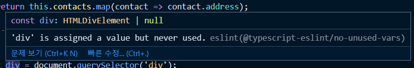
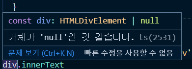

## 📖 타입 단언 (Type Assertion)
### 타입 단언 소개
```ts
let a; // a의 타입은 any
a =  10;
a =  'abc';
let b = a; // b의 타입도 any
```
`a`의 타입이 초반에 `any`로 정의되었기 때문에 값이 할당되었다고 해도 `b`타입은 `any`로 추측된다.  

```ts
let b = a as string;
```
타입단언 방식 `as string` 으로 타입을 정의해주면 `b`의 타입은 string으로 명확하게 정의되는 것을 볼 수 있다.

타입 단언은 
- 타입스크립트가 추정하지 못하는 부분까지 개발자가 선언해주는 것으로 생각하면 된다.
-  DOM API 를 조작할때 가장 많이 사용한다.


### 타입 단언 예제
```ts
// DOM API 조작
const div = document.querySelector('div');
```



실제 코드상에서 DOM에 접근해봤을떄 div 는 `HTMLElement`일수도 있고, `null`일 수도 있다고 나온다. 

```ts
div.innerText;
```



바로 innerText를 사용했을 경우 값을 보장해주지 않았기때문에 에러가 발생한다. if 문을 사용해서 div가 null일 수도 있을 것이라고 추측하고 div를 보장해주도록 한다.

```ts
// 타입에 대한 값을 보장
if (div) {
	div.innerText; 
}
```
 
 #### 타입단언을 이용한 보장

```ts
const div = document.querySelector('div') as HTMLDivElement;
```
div 를 `as HTMLDivElement`로 코드가 돌아가는 시점에 div 엘리먼트가 무조건 있을 것이다라는 선언을 한다.

이런식으로 엘리먼트를 접근했을때 `HTMLDivElement`라고 타입을 단언하는게 타입 단언이다.

  
```js
div.innerText; 
```
if문을 거치지 않아도 값을 단언했기때문에 에러없이 div 값에 바로 접근해서 사용이 가능하다.

> 정리하자면 타입 단언은 타입스크립트보다 개발자가 타입에 대해서 더 잘 알고있으니 개발자가 타입을 명시적으로 선언해주는 것이다.

### 🔍 참고 출처
- [타입스크립트 입문 - 기초부터 실전까지](https://www.inflearn.com/course/%ED%83%80%EC%9E%85%EC%8A%A4%ED%81%AC%EB%A6%BD%ED%8A%B8-%EC%9E%85%EB%AC%B8/dashboard)
