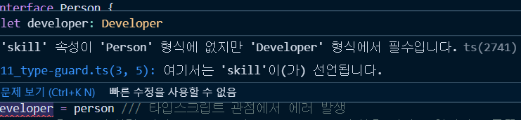

## 📖 타입 호환(Type Compatibility)
### 타입 호환이란?
**타입호환이란 타입스크립트 코드에서 특정타입이 다른 타입에 잘 맞는지를 의미한다.** 즉 타입코드를 해석해나가는 과정에서 두개의 타입이 서로 호환이 되는지를 점검하는 것 

```ts
interface Ironman {
  name: string;
}

class Avengers {
  name: string;
}

let i: Ironman;
i = new Avengers();
```

타입스크립트 관점에서는 타입에 정의되어있는 속성의 타입을 가지고 실제로 코드들이 호환되는지를 점검하는 것

> 구조적 타이핑

### 타입 호환 예제 - 인터페이스, 클래스
#### 인터페이스
```ts
interface Developer {
	name :  string;
	skill :  string;
}

interface Person {
	name :  string
}

let developer  :  Developer;
let person  :  Person;

developer = person /// 타입스크립트 관점에서 에러 발생
```
skill 이 없다는 에러발생



- **오른쪽에 있는 타입이 부분집합, 즉 더 작은관계를 유지하고 있기 때문에 구조적으로 더 큰 타입에서는 작은타입을 지원할 수 없다.**
- `person`은 name속성만 가지고 `developer`는 name, skill 속성을 가지고 있어서 오른쪽에 있는 속성이 왼쪽에 할당될 수가 없는 것
	- 이유는 객체가 더 많은 속성 (developer 왼쪽에 있는 타입)이 구조적으로 더 큰 관계를 갖고있기 때문이다.

> 타입호한은 오른쪽에 있는 속성이 더 많은 속성을 갖거나 구조적으로 더 컸을때 왼쪽과 호환이 된다.

#### 클래스
class 방식을 사용하더라도 타입이 맞지 않다고 하고있다. => 구조적
```ts
class Person{
	name :string
}

developer = new Person();
```


  

**반대로**

```js
person = developer;
```
적용했을때는 에러가 나지 않는다

  
  
#### 구조적 타이핑
구조적 타이핑이란 **타입스크립트에서 타입 코드들이 서로 맞는지 확인할때 타입별칭, interface, class 를 확인하는 것이 아니라 내부적으로 존재하고 있는 속성과 타입에 대한 정의들의 대해서 비교하는 것이다.**

### 타입 호환 예제 - 함수, 제네릭
#### 함수
```ts
// 함수 표현식으로 비교
// 함수자체를 변수에 담아서 비교하기 위해서
let add = function (a:number) { 
	// ... 생략
}  
let sum = function (a:number, b:number) {
	// ... 생략
}
```
- 첫번째 함수와 두번째 함수의 차이는 파라미터의 수 
- 구조적으로 `sum`이라는 함수가 `add` 함수보다 더 크다고 볼 수 있다.

```ts
sum = add
```
`sum`은 두개의 파라미터를 받을 수 있기 때문에 서로 호환이 가능하지만

```ts
add = sum
```
`add` 는 하나의 인자만 받기 때문에 당연히 호환이  안된다.

> **`sum`이 범위적으로 더 크고 더 넓기 때문에 `add` 에 `sum`을 할당하면 서로 호환이 되지 않는다.**

 
#### 제네릭
#### Empty
```ts
interface Empty<T> {
	// ...
}
let empty1:Empty<string>;
let empty2:Empty<number>;
```
인터페이스가 빈값이기 때문에

```ts
empty1 = empty2;
empty2 = empty1;
```
양쪽으로 호환이 가능하다.

#### NotEmpty
```ts
interface NotEmpty<T> {
	data:T
}

let notEmpty1:NotEmpty<string>;
let notEmpty2:NotEmpty<number>;

notEmpty1 = notEmpty2; // 서로 호환되지 않음
notEmpty2 = notEmpty1;
```
동일하게 속성은 있지만 string / number 여부로 구조적으로 차이가 생긴다.

 
> 타입 호환에 대해 정의를 하자면,
기본적으로 타입 호환은 함수 내부적으로 파라미터, 반환 타입이 많은 옵션을 가져갔을때 타입, 구조적으로 더 크다고 볼 수 있다.


### 🔍 참고 출처
- [타입스크립트 입문 - 기초부터 실전까지](https://www.inflearn.com/course/%ED%83%80%EC%9E%85%EC%8A%A4%ED%81%AC%EB%A6%BD%ED%8A%B8-%EC%9E%85%EB%AC%B8/dashboard)
-   [타입 호환이란?](https://joshua1988.github.io/ts/guide/type-compatibility.html)
