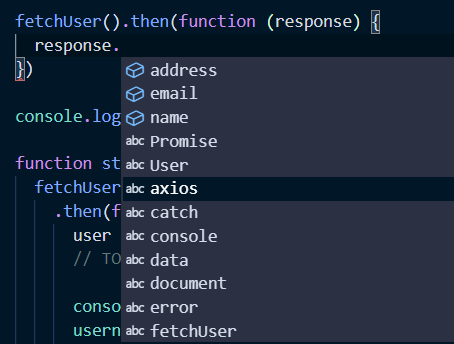
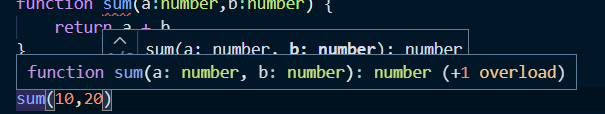
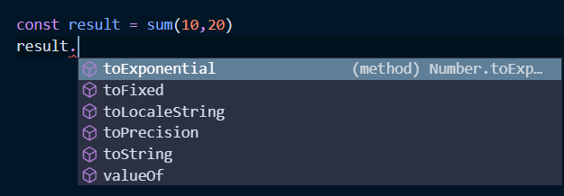
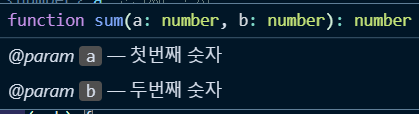

# [📖타입스크립트 입문 - 기초부터 실전까지](https://joshua1988.github.io/ts/)
자바스크립트로 제작된 COVID-19 세계 현황판을 타입스크립트로 변환해보면서 타입스크립트 개념과 기초를 배워보는 강좌.

- 교과과정
구현되어 있는 자바스크립트를 타입스크립트로 변환하기 위해 필요한 개념을 설명하고 실습.


## 📖 타입스크립트 소개와 배경

### 타입스크립트란?
- **자바스크립트에 타입을 부여한 언어**
- 자바스크립트의 값을 한눈에 확인할 수 있는 **확장된 언어**
- 타입스크립트는 자바스크립트와 다르게 브라우저에서 실행하기 위해 파일을 한번 변환해주는 과정이 필요하고 이러한 과정을 **컴파일(compile)**이라고 부른다.

### 왜 타입스크립트를 쓰면 좋은가요?
타입스크립트를 배우기 전에 
- **받아왔던 데이터의 모습, 형상들을 알지 못했을때 낼 수 있는 에러**
- **오타가 났을때 났던 에러**

부터 살펴보자.

jsonplaceholder 에서 axios로 user data 결과를 받아본다.

#### 1. 받아온 데이터 타입을 모를 경우
- api 데이터를 받아온뒤
	```js
	function  startApp() {
		axios
		.get(url)
		.then(function  (response) {
			user  =  response.data;
			// TODO: 이름, 이메일, 주소 표시하기
			username.innerHTML  =  user[0].name
			email.innerHTML  =  user[0].email
			address.innerHTML  =  user[0].address
		})
	}
	```
- 브라우저 결과
	```
	# 사용자 정보

	이름:  Leanne Graham

	이메일:  Sincere@april.biz

	주소:  [object Object]
	```

- address 같은 경우에는 ```[object Object]```라는 출력 결과가 나온다.
	- user[0].addres같은 경우는 객체타입이다. 이 부분을 확인하지 못하고 그대로 출력했을때 다음과 같은 결과를 초래할 수 있다.

#### 2. 오타를 입력 
- address가 아닌 addres라고 **오타**를 입력했을 경우? 
	- ```undefined``` 출력 

	- 에러로 바로 연결

존재하지 않는 의미없는 데이터를 가지고 화면에 출력하고 함수를 호출했을 경우 에러 발생할 수 밖에 없는 상황이 발생하게 되는데 이러한 관점에서 **타입스크립트의 필요성**을 느낄 수 있다.


### 자바스크립트에 타입이 있을 때의 첫 번째 장점 - 에러 사전 방지
타입스크립트로 변환 전에 **JS 코드 자체에서 타입이 추가됐을때** 장점부터 살펴보자.

- **data 불러오는 함수를 ```fetchUser()``` 에 생성**
	```js
	function  fetchUser() {
		return  axios.get(url)
	}
	```
	- 여기서 문제는 코드편집기상에서 ```conloe.log(fetchUser())```로 찍어보기 전까지 반환되는 결과를 확인할 수 없다.

#### ```fetchUser()```에 대한 내용을 코드에서 볼 수 있으려면?
- js Doc 주석을 사용해서
	```js
	/**
	*
	*/
	```
- **```fetchUser()``` 타입 정의**
	```js
	// address 속성 정의
	/**
	* @typedef  {object}  Address
	* @property  {string}  street
	* @property  {string}  city
	*/
	
	// user 속성 정의
	/**
	* @typedef  {object}  User
	* @property  {string}  name
	* @property  {string}  email
	* @property  {Address}  address // Address 객체의 속성 정의
	*/
	
	/**
	* @returns  {Promise<User>}
	*/

	function  fetchUser() {
		return  axios.get(url)
	}
	```
	- ``@returns  {Promise<User>}`` fetchUser를 호출하고 나면 Promise에 user라는 항목이 담겨있을 것 이라는 뜻.

	- ```{type}``` ```{}```안에 들어오는 것은 type

- **타입을 정의한 결과**

	

	```fetchUser()``` 콜백을 받아봤을때 type을 설정했던 name, emil, address가 **자동완성이 되는 것**을 볼 수 있다.

- **정의하기 전과의 차이점**
	- data를 확인하기 위해서 response.data로 콘솔에 먼저 찍어보고 일일이 데이터를 확인하고 기억한뒤 입력했었다면, 
	- 현재는 파란색 블럭으로 프로퍼티와 타입이 제공되고 데이터 안에 어떤 값이 있는지 코드상에서 미리 확인할 수 있다.


#### 장점 정리
- 브라우저로 넘어가기 전에 어느정도의 케이스들을 코드상에서 확인하고 미리 처리한뒤 에러를 확인하는게 타입스크립트의 장점, 특징이라고 볼 수 있다.

### 자바스크립트에 타입이 있을 때의 두 번째 장점 - 코드 자동완성과 가이드
- 두 수의 합을 구하는 sum 함수를 js파일로 생성
	```js
	// sample.js
	function  sum(a,b) {
		return  a  +  b;
	}
	```
	- sum 함수는 두 수의 합을 구한다는 관점에서 숫자만 입력해야한다.

	- 만약에 숫자가 아닌 문자를 입력했을때? 결과가 숫자 + 문자열이기 때문에 1020이 출력된다.
	- sum() 호출시 sum(a :any, b:any)와 같은 자동완성 결과를 볼 수 있다.
	- 이러한 문제점을 이용해서 호출할때 숫자타입만 받을 수 있는 함수를 만들자.

#### 타입스크립트로 타입을 정의
- 두 수의 합을 구하는 sum 함수를 ts파일로 생성
- 타입정의
	```js
	// sample.ts
	function  sum(a:number,b:number) {
		return a + b
	}

	sum(10,20)
	```
	- 다음과 같이 sum에 인자값을 number 타입으로 정의해주고, 마우스를 오버해서 자동완성을 확인해보자.

		
	
		**타입스크립트에서는 a와 b의 type이 number이고, 반환해주는 값도 number라고 자동적으로 추론한다.**

- ```sum(a:number,b:number):number``` 명시적으로 반환해주는 타입까지 정의해줄 수도 있다.

#### 타입스크립트의 장점
- **에러 확인**
	- ```sum(10,'20')``` 처럼 number가 아닌 다른 타입을 입력했을때 코드상에서 타입스크립트가 빨간줄로 표시해주고 에러를 미리 확인할 수 있다.

- **타입과 관련된 함수 자동완성 추천**
	```ts
	const result = sum(10,20)
	result.toLocaleString()
	```
	
		
		
		
	- result는 값이 number 타입이라고 되어있기 때문에 number에서 제공하는 api들을 한눈에 확인하고 활용할 수 있도록 자동완성된다. 그렇기때문에 훨씬더 편하고 정확하게 코드를 작성할 수 있다


### 자바스크립트를 타입스크립트처럼 코딩하는 방법
```js
/**
*
* @param  {number}  a 첫번째 숫자
* @param  {number}  b 두번째 숫자
*/

function  sum(a,b) {
	return  a  +  b
} 
sum(10,20)
```
- 부가적으로 함수에 대한 설명까지 정의해줄 수 있고 js상에서 자동완성으로 정의한 내용까지 보여준다.

	

- 그렇지만 ```sum(10,'20')``` 다른 타입을 입력했을경우에는 타입스크립트 파일처럼 명시적으로 빨간줄의 에러가 나타나지 않는다.

- ```// @ts-check``` 를 입력해주게 되면 타입스크립트와 같은 효과를 주게된다. 
	- 추가하면 타입을 잘못 입력했을때 빨간줄이 생긴다.


### 🔍 참고 출처
- [타입스크립트 입문 - 기초부터 실전까지](https://www.inflearn.com/course/%ED%83%80%EC%9E%85%EC%8A%A4%ED%81%AC%EB%A6%BD%ED%8A%B8-%EC%9E%85%EB%AC%B8/dashboard)
- [타입스크립트란?](https://joshua1988.github.io/ts/why-ts.html#%ED%83%80%EC%9E%85%EC%8A%A4%ED%81%AC%EB%A6%BD%ED%8A%B8%EB%9E%80)

- [jsdoc](https://devdocs.io/jsdoc/)
