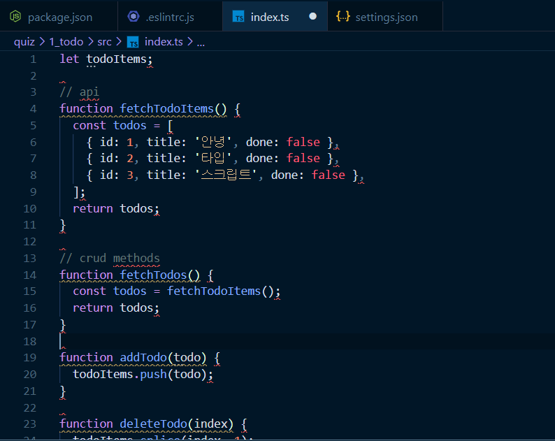
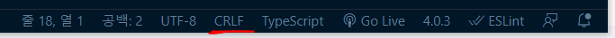
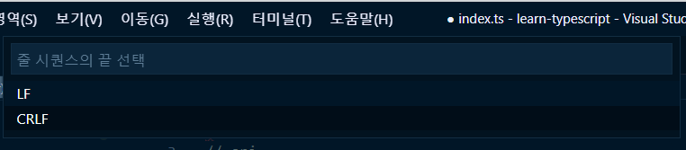
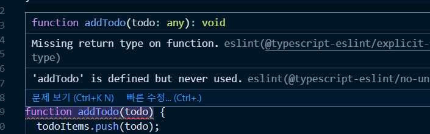
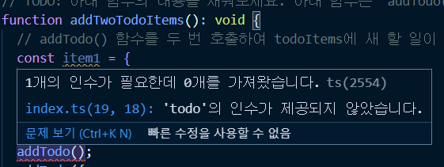
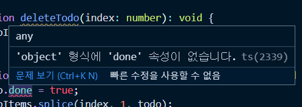

## 📖 첫 번째 프로젝트 - 할 일 관리 애플리케이션
###  첫 번째 실습 프로젝트 소개, 환경 구성, 코드 분석
- quiz 폴더 todo 파일 ```npm i``` 설치

#### ESLint 에러 해결 1
- 타입스크립트 파일에서 eslint가 적용되지 않는다. 타입스크립트의 에러를 알리는 빨간줄이 그어져 있어야 한다.
- 다행이 강의 질문글에 해결방법이 있어서 따라해보았다.

1.  ```settings.json``` 파일을 생성한뒤 아래와 같은 설정을 추가해줬다.
	- 이 방법은 프로젝트 별로 설치된 eslint 설정 파일 경로를 잡는 것이라고 한다.

```js
{
	"eslint.workingDirectories" : [
		{ "mode" : "auto" }
	]
}
```
2. but 위처럼 설정해줬지만 eslint가 동작하지 않았다.  그래서 **eslint 버전을 낮춰줬더니 해결**되었다.

#### eslint 에러해결 2



- eslint를 설정해줬더니 (적용은 잘되었지만..) 코드상에서 온통 빨간 에러가 떴다. 
	- 에러 메세지는 ```Delte `CR` 
eslint(prettier/prettier)```


- **에러 발생 지점은 줄바꿈이 있는 공간마다 빨간줄이 생기는 것**
- 아무래도 선생님이 사용하시는 mac 프로젝트를 window에서 사용하다보니 줄바꿈 설정에서 오류가 있는 것 같았다.
- **확인해보니 vscode 상에서 end of line 기본 설정이 CRLF로 설정되어있었다.**



- **이 설정을 LF로 바꿔줬더니 해결!**




### 프로젝트 구성 파일 소개(NPM, ESLint, TS)
### 실습 방법 안내 및 any, void 소개
- 타입스크립트 설정파일`tsconfig.json` 에서 `"noImplicitAny"`의 설정을 true로 변경

	- 변경해주면 타입을 설정해주지 않은 변수들에서 빨간줄이 표시된다.

#### any
- `any`란? `string`, `number`, `array`등 모든 타입을 통칭한다.
- 일종의 치트키 같은 것. 자바스크립트 원래 성질인 실행하는 시점에 타입을 구분한뒤 타입을 할당해주는 관점에서 `any` 와 비슷하다고 생각할 수 있다.
- **처음에 타입을 정의할때 `any`타입으로 먼저 지정하고 차근차근 구체적인 타입으로 정의해 나가는게 정상적인 방법**

> 프로젝트시에는 any가 아니라 구체적으로 타입을 지정하는 방법을 권장
> but 타입을 잘 모르겠다면 any라도 붙여주자

#### void


- ```void``` 란 함수의 반환 타입이 없다는 것을 명시적으로 지적해주는 것.
- **리턴값이 없는 함수들 같은 경우에는 `void` 를 추가해준다.**
```js
function  addTodo(todo):  void {}
```

### 실습 풀이 1 - 변수, 함수 타입
- todos를 담는 toDoItems의 타입 형태 - `[{ 객체 }]`
```js
const todos = [
	{ id: 1, title: '안녕', done: false },
	{ id: 2, title: '타입', done: false },
	{ id: 3, title: '스크립트', done: false },
]
```
- 배열안에 객체를 담은 타입스크립트 만의 정의로 각 타입을 지정해줌
```js
let todoItems:  object[];
```

### 실습 풀이 2 - filter API & 화살표 함수 소개
#### ```filter```란
특정 조건에 해당하는 아이템만 필터링해주는 api
```js
const arr = [
	{ gender: 'male', name: 'john' },
	{ gender: 'female', name: 'sarah' },
	{ gender: 'male', name: 'bone' },
];

const filtered = arr.filter(function (item) {
	if (item.gender === 'female') {
		return item;
	}
});

console.log(filtered);
```
- 브라우저 밖에서 노드 명령어로 바로 결과 출력
```bash
$ node filter.js

[ { gender: 'female', name: 'sarah' } ]
```
- node는 자바스크립트에서 실행할 수 있는 브라우저 밖의 실행환경

### 실습 풀이 3 - 함수 구현
```js
function  addTwoTodoItems():  void {
	addTodo(); // 타입스크립트 상에서 인자값을 전달해주지 않아서 에러 발생
}
```



- 마우스 오버시 타입 스크립트에서 인수가 전달되지 않았다는 알림을 해준다.


### 실습 풀이 4 - 오류 해결 및 구체적인 타입 정의

#### 에러를 확인하는 방법



- 타입스크립트에서 에러의 원인을 알지 못했을때 마우스오버했을때 나오는 알림창을 읽어보면 원인을 파악할 수 있다.

- 오른쪽에 나오는 ```(ts2399)```라는  error code로 구글링하면 자세한 자료를 찾을 수 있다.

#### 구체적 타입 정의
```js
function completeTodo(index:  number, todo:  object):  void {	
	todo.done  =  true; // 오류난 부분
	todoItems.splice(index,  1, todo);
}
```
- `'object'  형식에 'done' 속성이 없습니다.`  라는 에러메세지의 의미는 
	- todo라는 파라미터의 타입이 object정의해줬기 때문에 object안에 'done' 이 있다는 것이 보장되지 않고 있다.

	- **때문에 객체 형식안에서의 각 속성들을 구체적으로 정의해줘야 한다.**
- 배열 안에 객체에 대한 구체적인 타입 정의 
```js

let todoItems: { id:  number; title:  string; done:  boolean }[];
```
- 위와 같이 object 값을 인자로 받는 함수에서 속성에 대한 구체적인 타입을 정의해주면 타입스크립트 오류가 해결된다.
```js
1. 
function  addTodo(todo: { id:  number; title:  string; done:  boolean }):  void {}

2.
function  completeTodo(
index:  number,
todo: { id:  number; title:  string; done:  boolean }
):  void {}
```


### 실습 풀이 5 - 중복된 코드 제거 및 인터페이스 소개
타입스크립트라는것은 어려운 개념이 아니라 자바스크립트의 타입을 명확하게 명시적으로 지정해준다라고 이해하면 된다.


#### 인터페이스
- `interface`를 이용해서 중복되는 타입을 간결하게 정의한다.

```js
// 변수에 인터페이스 활용
interface Todo {
	id:  number;
	title:  string;
	done:  boolean;
}

let todoItems:  Todo[];
```

### 🔍 참고 출처
- [인프런 질문 링크](https://www.inflearn.com/questions/36296)
