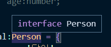
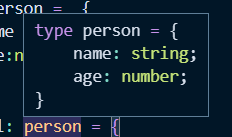

## 📖 타입 별칭
### 타입 별칭 소개
타입별칭은 특정타입이나 인터페이스를 참조할 수 있는 타입 변수를 의미한다.

```ts
// string 타입을 사용할때
const name:string = 'joo';

// 타입 별칭을 사용할때
type MyName = string;
const name: MyName = 'joo'
```
- interface 같은 복잡한 레벨에서도 별칭을 부여할 수 있다.
```ts
type Developer = {
	name : string,
	skill : string
}
```

### 타입 별칭 코드 예제
```ts
// interface
interface Person {
	name : string;
	age:number;
}
// 타입 별칭
type Person = {
	name :string;
	age:number;
}

let dal:  Person = {
	name : '달이',
	age:30
}
```

인터페이스와 달리 타입별칭은 타입스크립트내에서 타입을 정의한 모습을 구체적으로 확인시켜준다.

```ts
type MyString =  string;
var str:  MyString = 'hello'

type Todo = { id:  string; title:  string; done:boolean };
function  getTodo(todo:Todo) { }
```
타입별칭은 인터페이스 형식뿐만 아니라 다른 형식으로도 사용할 수 있다.

### 타입 별칭과 인터페이스의 차이점
#### 타입별칭의 특징
타입 별칭은 새로운 값을 하나 생성하는 것이 아니라 정의한 타입에 대해서 나중에 쉽게 참고할 수 있게 이름을 부여하는 것이라고 이해하면 된다.

- 인터페이스 프리뷰



- 타입별칭 프리뷰



#### 인터페이스 vs 타입별칭
확장이 가능한 인터페이스에 반해 **타입 별칭은 확장이 불가능하다.**

따라서 가능한한 `type`보다는 `interface`를 선언해서 사용하는 것을 권장한다.

### 🔍 참고 출처
- [타입 별칭](https://joshua1988.github.io/ts/guide/type-alias.html)
